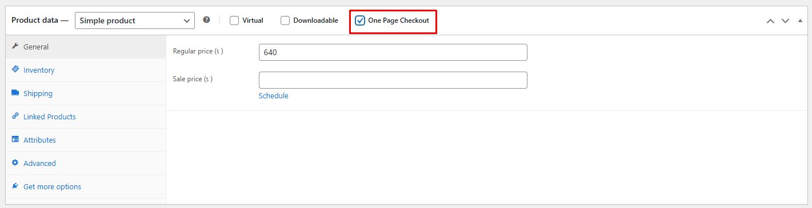

# One Page Quick Checkout for WooCommerce

**Contributors:** Plugincy  
**Tags:** WooCommerce, Popup Checkout, Quick Checkout, One-Page Checkout, Cart Drawer  
**Requires at least:** 5.0  
**Tested up to:** 6.8  
**Stable tag:** 1.0.3  
**Requires PHP:** 7.2  
**License:** GPLv2 or later  
**License URI:** https://www.gnu.org/licenses/gpl-2.0.html  

Enhance WooCommerce with popup checkout, cart drawer, and flexible checkout templates to boost conversions.

---

## Description

**One Page Quick Checkout for WooCommerce** revolutionizes your store's checkout process by offering a frictionless, on-page purchasing experience. It allows customers to complete transactions without page redirects, significantly reducing cart abandonment and enhancing conversion rates.

### Key Features

- **Popup Checkout Form**  
  Enable a convenient popup checkout form that allows customers to complete purchases without leaving the current page.

- **Complete Checkout Form Customization**  
  Easily manage checkout form fields, labels, placeholder text, and required fields to create the perfect checkout experience.

- **Product Quantity Controls**  
  Let customers adjust product quantities directly within the checkout form with intuitive controls.

- **One-Click Product Removal**  
  Allow customers to remove products from their order directly from the checkout form with a simple remove button.

- **Enhanced Product Display**  
  Add product images to the checkout form for better visual identification.

- **Menu Cart with Slide-Out Drawer**  
  Implement a sleek, accessible cart menu with a slide-out drawer for easy cart management from anywhere on your site.

- **Single Product One-Page Checkout**  
  Enable instant purchasing for individual products with a dedicated one-page checkout experience.

- **Multiple Product Checkout Templates**  
  Choose from various display options:
  - Product Table
  - Product List
  - Product Single
  - Product Slider
  - Product Accordion
  - Product Tabs
  - Pricing Table

- **Quick Checkout Buttons**  
  Add convenient checkout buttons to both single product pages and archive/category pages.

- **AJAX-Powered Checkout**  
  Complete the entire checkout process without page refreshes for a smooth, app-like experience.

---

## Installation

### From your WordPress Dashboard
1. Go to **Plugins > Add New**
2. Search for **One Page Quick Checkout for WooCommerce**
3. Click **Install Now** and then **Activate**

### Manual Installation
1. Download the plugin ZIP file
2. Upload it to your WordPress site under the **wp-content/plugins/** directory
3. Go to **Plugins** and activate **One Page Quick Checkout for WooCommerce**

---

## Usage

### Menu Cart Implementation
Add the cart drawer to your navigation:
```
[plugincy_cart]
```
### Single Product Quick Checkout
Enable one-page checkout for specific products:

1. Go to **Products > Edit** for any product
2. Find the **One Page Checkout** checkbox in the product data panel
3. Check the box to enable quick checkout for this product



> **Note:** Include a screenshot showing the product edit page with the One Page Checkout checkbox highlighted.

### Multiple products one-page checkout with various display templates
Display products with a built-in checkout using these shortcodes:

**Product Table Layout:**
```
[plugincy_one_page_checkout product_ids="152,153,151,142 " template="product-tabs"]
```

**Product List Layout:**
```
[plugincy_one_page_checkout template="product-list" product_ids="12,15,18"]
```

**Single Product Layout:**
```
[plugincy_one_page_checkout template="product-single" product_ids="12"]
```

**Product Slider Layout:**
```
[plugincy_one_page_checkout template="product-slider" product_ids="12,15,18,21"]
```

**Product Accordion Layout:**
```
[plugincy_one_page_checkout template="product-accordion" product_ids="12,15,18"]
```

**Product Tabs Layout:**
```
[plugincy_one_page_checkout template="product-tabs" product_ids="12,15,18"]
```

**Pricing Table Layout:**
```
[plugincy_one_page_checkout template="pricing-table" product_ids="12,15,18"]
```

---

## Frequently Asked Questions (FAQ)

**Q: Is this plugin compatible with all WooCommerce themes?**  
A: Yes, One Page Quick Checkout for WooCommerce is designed to be compatible with most WooCommerce themes. In case of styling conflicts, you can use the customization options to ensure proper display.

**Q: Can I customize the appearance of the checkout popup?**  
A: Absolutely! The plugin offers extensive customization options for colors, button text, form layout, and more through the plugin settings page.

**Q: Will the plugin work with variable products?**  
A: Yes, the plugin fully supports variable products, displaying product variations within the checkout form for customer selection.

**Q: Can I use this with my existing payment gateways?**  
A: Yes, the plugin seamlessly integrates with all WooCommerce payment gateways including PayPal, Stripe, and others.

**Q: Does this plugin support AJAX cart updates?**  
A: Yes, all cart and checkout actions are processed via AJAX, ensuring a smooth, refresh-free experience throughout the entire purchasing process.

**Q: Can I use this for specific products only?**  
A: Yes, you can specify which products use the quick checkout functionality and which follow the standard WooCommerce checkout process.

**Q: Will this work with my multi-language site?**  
A: The plugin is translation-ready and compatible with popular translation plugins like WPML and Polylang.

---

## Changelog

### 1.0.3
- Initial release with complete feature set including popup checkout, menu cart drawer, product templates, and AJAX checkout processing

---

## Support

For support, feature requests or bug reports, please visit [Plugincy Support](https://plugincy.com/support) or email us at support@plugincy.com.

---

## License

This plugin is licensed under the GPLv2 or later. See [LICENSE](https://www.gnu.org/licenses/gpl-2.0.html) for more details.

---

## Credits

Developed by **Plugincy** - A team dedicated to creating high-quality, conversion-focused WooCommerce extensions.